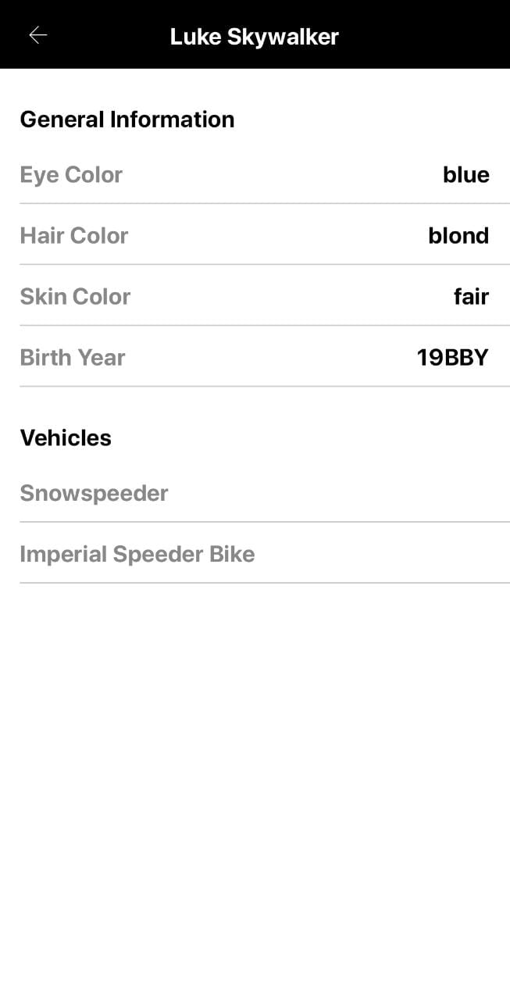
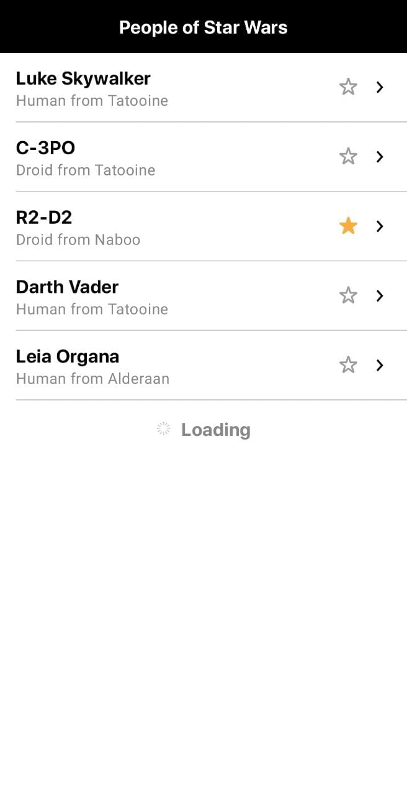

# StarWars Challenge

Application to display Star Wars characters list with details

## Screenshots

## Built With

### Languages
- 

### Build tools
- 

### Platform
- 

### Editors
- 

### Version controllers
- 
- 

## Dependencies used
### Frameworks
- Compose

### Persistence
- SharedPrefs

### API
- GraphQl

### Installation

1. Clone the repo

   git clone https://github.com/PauloSzT/Ravn-Challenge-V3-PauloSanchez.git

2. Open Android Studio

   cd ...~/Ravn-Challenge-V3-PauloSanchez

3. Debug

   Open emulator or android device.

## Author

👤 **Paulo Sanchez**
(Click the linked badges below)
- 

## 🤝 Contributing

Contributions, issues, and feature requests are welcome!

Feel free to check the [issues page](https://github.com/PauloSzT/star_wars_challenge/issues).

## Show your support

Give a ⭐️ if you like this project!

## 📝 License

This project is [MIT](./LICENSE) licensed.